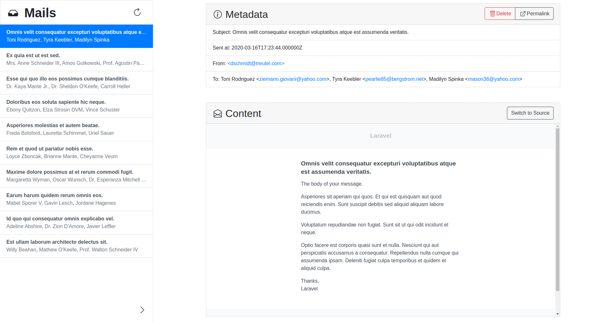
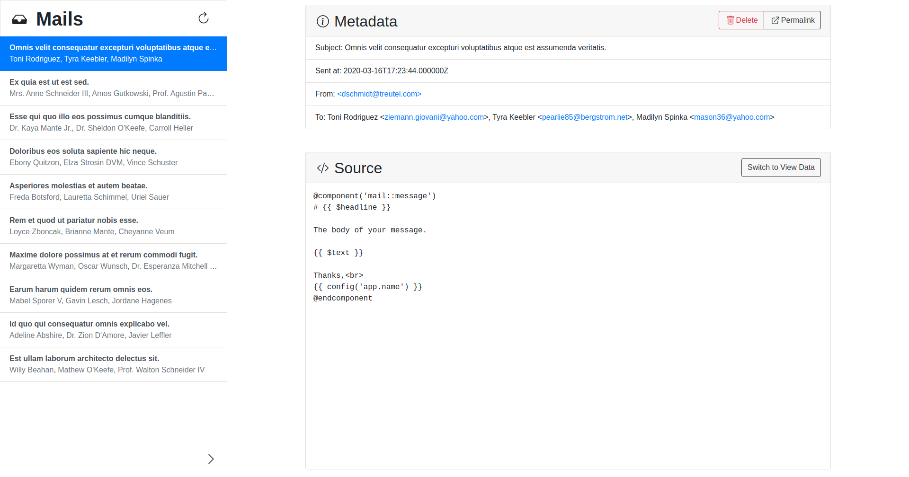
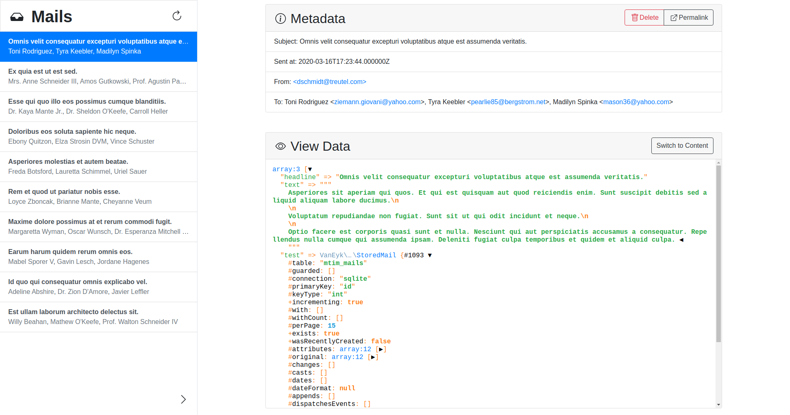

# ✉️ Mail in the middle 📯

Preview the mails sent by your applications just like you would with services 
like [Mailtrap](https://mailtrap.io/). You can also [view the template source 
and view data of your Mailables](#more-screenshots).

<p align="center"></p>

<p align="center">
    <a href="https://github.com/niclasvaneyk/laravel-mail-in-the-middle/actions"></a>
    <a href="https://packagist.org/packages/niclasvaneyk/laravel-mail-in-the-middle"></a>
    <a href="https://packagist.org/packages/niclasvaneyk/laravel-mail-in-the-middle"></a>
    <a href="https://packagist.org/packages/niclasvaneyk/laravel-mail-in-the-middle"></a>
</p>

If you send a mail using `Mail::send(new MyMailable())`, the mail will be 
stored either in your database or on your filesystem. You can then visit 
`localhost:8000/mails` (or whatever your `APP_URL` is set to), to see the 
latest mails sent by your system. The UI shows metadata, like subject, sender, 
recipients, cc, bcc, as well as Laravel-specific information, like 
[the source of your mail-template](#source) or [the data provided to your
template](#view-data).

## Setup

### Installation

Require the library via composer:

```shell script
composer require niclasvaneyk/laravel-mail-in-the-middle --dev
```

Add the following entry to the `mailers` array in your `config/mail.php`:

```php
// ...

'mailers' => [
    // the standard mailers, the one before this is usually 'array'...
    
    // This entry needs to be added
    'mail-in-the-middle' => [
        'transport' => 'mail-in-the-middle',
    ],
],

// rest of the configuration...
```

Add / replace the following parts in your `.env`-file:

```dotenv
MAIL_MAILER=mail-in-the-middle
```

If you are sending your `Mailable`s via the default `Mailer` (e.g 
`Mail::to('recipient@company.org')->send(new MyMailable())`) they will now 
show up in the UI. The UI is available, if `APP_DEBUG` is set to true. 
Otherwise it can be enabled/disabled by setting the `MAIL_IN_THE_MIDDLE_ENABLED`
environment variable or by manually configuring the `'register_routes'`-value
of the `config/mail-in-the-middle.php` file. 

**WARNING**: any mails, that are sent using another mailer, e.g. if you 
explicitly define, that a `Mailable` should be sent through Mailgun using 
`Mail::mailer('mailgun')->send(new MyMailable())` will be sent out to the 
recipient. The [official documentation](https://laravel.com/docs/7.x/mail#sending-mail)
provides more information.

### Configuration

For now, the package ships with two options to store your mails:

- The `filesystem` driver (default) stores the mails on disk
- The `database` driver saves them to a database table

The `filesystem` driver was chosen to be the default storage option,
as it just works out of the box. If no `disk` is set, a local folder under 
`storage/app/mail-in-the-middle` is created and used.

**If a huge amount of mails are sent by your application, you should definitely 
consider using the `database` driver!** You can configure the driver by setting
the `MAIL_IN_THE_MIDDLE_STORAGE_DRIVER` environment variable to one of the 
options inside the `config/mail-in-the-middle.php`. If you are using the 
`database` driver, the necessary migrations should be loaded automatically, just
make sure you call `php artisan migrate` before you send your first mail.

For all configuration options, like the path under which you can reach the ui, 
take a look at the 
[`mail-in-the-middle.php`-config](config/mail-in-the-middle.php), which can be
published and adjusted to your `config/`-directory.  

### Housekeeping

As it is more likely that you are more interested in the most recently sent 
mails, and for example the `filesystem` driver gets more slow the more mails 
are stored by your system, it is advised to delete old mails from time to time.

This can either be done through the UI using the red *Delete*-button, or by 
scheduling a command, that runs regularly and cleans up mails, that have 
passed a certain age. The latter can be done fairly easily if you have 
[setup scheduling](https://laravel.com/docs/scheduling) by adding the 
following to your `App\Console\Kernel::schedule`-method:

```php
class Kernel extends ConsoleKernel
{
    // ...
    protected function schedule(Schedule $schedule)
    {
        $schedule
            ->command("mitm:clear-mails-older-than 'last week'")
            ->daily();
    }
    // ...
```

Alternatively you can run that command manually from time to time by executing
`php artisan mitm:clear-mails-older-than 'one week'` in the shell of your 
choice.

## More Screenshots

### Source 


In this tab you can see the contents of your `.blade.php`-view or 
markdown template. If you have a good idea on how to add syntax highlighting
shoot me a dm, because I did not found one for higlightjs or prism (my last 
idea would be to try using the monaco editor and the 
[blade-language-extension](https://marketplace.visualstudio.com/items?itemName=cjhowe7.laravel-blade)).

### View Data


This tab shows the data that was used to render the html of the email as a 
`var_dump`. If the object is not a scalar value like an integer or a string, 
you can inspect the properties by collapsing / opening them using the black 
arrows next to them.

## Scope, feature additions and contributing

The initial use case that sparked the creation of this package was to provide
a project manager or tester with the abilityto easily inspect the mails sent by
the application, without the risk of actually sending them out to potential 
users. Additionally, the mails never leave your system.

So if you import your users from a csv file and send them an initial password, 
you can safely run the importer on your dev or qa system, without accidentally 
sending out mails to real users.
 
As this use-case is satisfied, it is unlikely that more advanced 
features like advanced searching capabilities, multiple inboxes or other forms 
of access control will be added in the near future. This being said, if you 
want to contribute such features I am open to any PRs, but it is recommended to
[file an issue](https://github.com/NiclasvanEyk/laravel-mail-in-the-middle/issues/new) 
first with a description of your proposed feature addition to get some feedback.

## Known issues

This package does not seem to function correctly if you set 
`"minimum-stability"` to `"lowest"` on windows. As I have currently no access
to a windows machine I cannot reproduce this locally.
